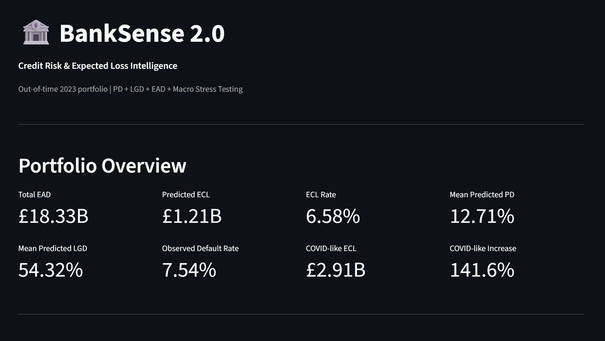
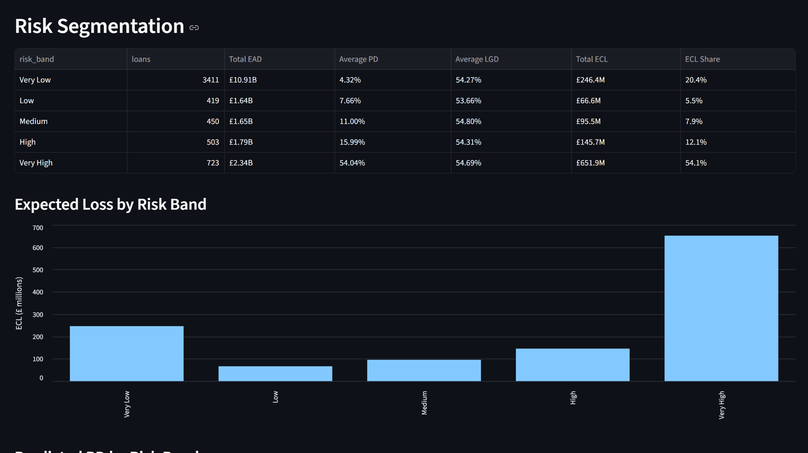
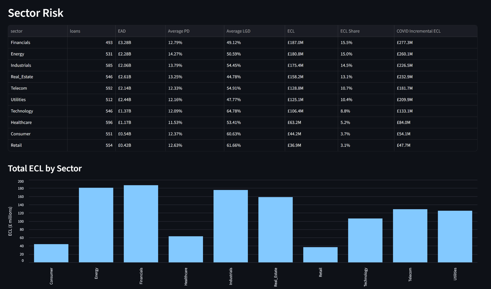
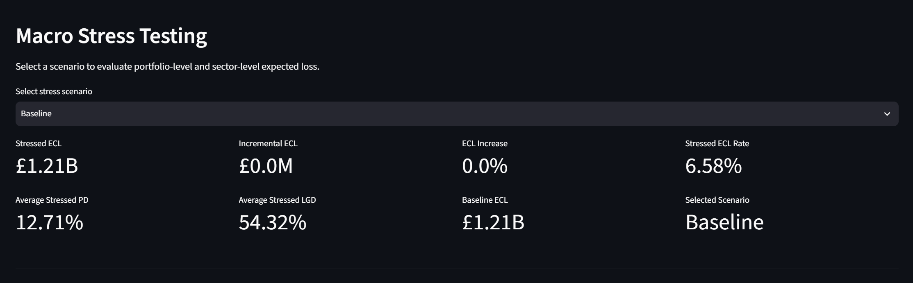
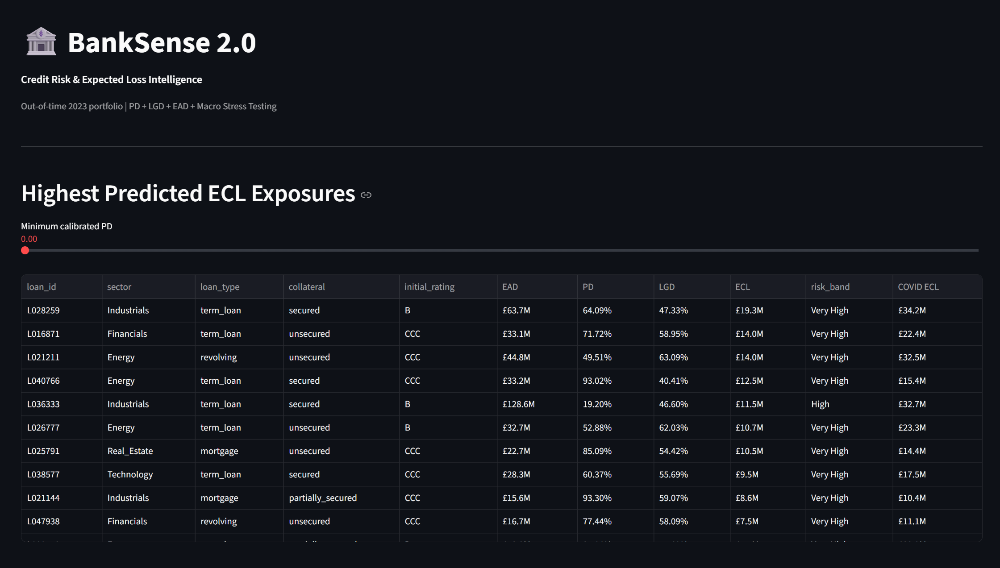

# BankSense 2.0 🏦

## Credit Risk, Expected Loss & Macro Stress Testing

BankSense 2.0 is an end-to-end credit-risk analytics project built around a synthetic banking portfolio.

The project covers the full analytical workflow:

**Data Audit → Data Cleaning → Leakage Analysis → PD Modelling → PD Calibration → LGD Modelling → ECL → Macro Stress Testing → Portfolio Risk Dashboard**

The objective is to demonstrate how borrower-level risk models can be combined with exposure information and macroeconomic scenarios to produce portfolio-level credit-risk insights.

---

## 🚀 Project Highlights

### Probability of Default (PD)

A Logistic Regression model was developed using origination-time information and evaluated using a chronological out-of-time test.

**2023 out-of-time results:**

| Metric | Result |
|---|---:|
| ROC-AUC | **0.8889** |
| KS | **0.6402** |
| Raw Brier Score | 0.0705 |
| Platt-Calibrated Brier Score | **0.0584** |

Platt calibration materially improved probability calibration while preserving the model's ranking performance.

---

### Risk Segmentation

Validation-derived PD thresholds were applied to the 2023 out-of-time population.

| Risk Band | Average Predicted PD | Observed Default Rate |
|---|---:|---:|
| Very Low | 4.35% | **0.89%** |
| Low | 7.66% | **3.58%** |
| Medium | 11.00% | **10.44%** |
| High | 15.99% | **12.13%** |
| Very High | 51.17% | **33.33%** |

Observed default rates were monotonic across the risk bands.

The observed default rate increased from **0.89%** in the Very Low band to **33.33%** in the Very High band.

---

### Loss Given Default (LGD)

LGD modelling was performed on defaulted loans only.

The model used:

**HistGradientBoostingRegressor**

**2023 out-of-time performance:**

| Metric | Result |
|---|---:|
| MAE | **0.0802** |
| RMSE | **0.0990** |
| R² | **0.5448** |

The model materially outperformed a simple mean-LGD baseline.

---

### Expected Credit Loss (ECL)

BankSense calculates loan-level expected credit loss as:

```text
ECL = PD × LGD × EAD
```

This combines:

- Probability of Default
- Loss Given Default
- Exposure at Default

to estimate expected loss at loan and portfolio level.

---

## 📊 2023 Portfolio Snapshot

| Metric | Result |
|---|---:|
| Test loans | **5,506** |
| Total EAD | **£18.33B** |
| Observed default rate | **7.54%** |
| Mean calibrated PD | **12.71%** |
| Mean predicted LGD | **54.32%** |
| Predicted ECL | **£1.21B** |
| ECL rate | **6.58%** |
| COVID-like stressed ECL | **£2.91B** |
| COVID-like ECL increase | **141.6%** |

---

# 🌪️ Macro Stress Testing

BankSense contains six audited macroeconomic scenarios:

```text
Baseline
Mild
Adverse
GFC-like
Severe
COVID-like
```

Scenario-specific sector PD and LGD stress multipliers are applied to the independently generated loan-level model outputs.

### Out-of-Time Stress Results

| Scenario | Average PD | Average LGD | BankSense ECL | Increase vs Baseline |
|---|---:|---:|---:|---:|
| Baseline | 12.71% | 54.32% | **£1.206B** | 0.0% |
| Mild | 15.15% | 55.70% | **£1.482B** | 22.9% |
| Adverse | 18.32% | 57.54% | **£1.866B** | 54.7% |
| GFC-like | 21.01% | 58.92% | **£2.207B** | 83.0% |
| Severe | 22.41% | 59.83% | **£2.398B** | 98.9% |
| COVID-like | **26.17%** | **61.67%** | **£2.913B** | **141.6%** |

The COVID-like scenario produces the largest modeled ECL increase.

---

# 🏭 Sector Risk Analysis

The project evaluates portfolio risk across sectors using:

- Exposure at Default
- Predicted PD
- Predicted LGD
- Expected Loss
- Stress incremental ECL

Under the COVID-like scenario, the largest absolute incremental ECL contributors were:

| Sector | Incremental ECL | Incremental ECL / £1M EAD |
|---|---:|---:|
| **Financials** | **£277.3M** | £84.5K |
| **Energy** | **£260.1M** | **£113.9K** |
| **Real Estate** | **£232.9M** | £89.3K |
| **Industrials** | **£226.5M** | **£109.7K** |
| **Utilities** | **£209.9M** | £85.9K |

This demonstrates an important portfolio-risk distinction:

> The largest absolute loss contributor is not necessarily the highest-risk sector per unit of exposure.

Financials produces the largest absolute incremental ECL, while Energy has substantially higher incremental ECL intensity per £1M of EAD.

---

# 🔍 Model Interpretation

## PD Model

The Logistic Regression model learned several economically interpretable relationships.

Lower-quality initial credit ratings were associated with higher modeled default odds.

Higher credit scores were associated with lower modeled default odds.

Longer maturity was associated with higher modeled default odds.

Numeric predictor correlations were generally weak. The largest observed absolute pairwise correlation was approximately:

```text
Credit Score vs Coupon Rate = -0.170
```

No obvious severe pairwise multicollinearity problem was identified among the numeric predictors.

---

# 🔐 Leakage & Feature Governance

A major component of BankSense 2.0 is distinguishing information available at origination from information that is outcome-derived or downstream.

### Origination-time candidate features

```text
maturity_months
sector
loan_type
collateral
initial_rating
credit_score
coupon_rate
leverage
interest_coverage
debt_to_equity
```

### Excluded from the primary PD model

```text
default_date
survival_months
recovery_rate
loss_given_default
el
unexpected_loss
rwa
```

These variables were excluded because they are known only after the outcome or are downstream risk calculations.

`pd_annual` was retained as a benchmark rather than used as a primary PD feature.

---

# ⏱️ Out-of-Time Validation

The project deliberately avoids relying only on random train/test splitting.

The main PD temporal structure is:

```text
2015–2020 → Training
2021       → Calibration fitting
2022       → Calibration selection
2023       → Final out-of-time test
```

Observed default rates changed materially across the periods:

| Dataset | Default Rate |
|---|---:|
| Training | **16.87%** |
| Validation | **8.15%** |
| Test | **7.54%** |

This temporal shift is one of the key model-risk findings.

---

# ⚠️ Important Model-Risk Finding

The PD model demonstrates strong out-of-time discrimination but residual probability overprediction remains.

For the 2023 test population:

```text
Observed default rate       = 7.54%
Mean raw PD                 = 20.39%
Mean Platt-calibrated PD    = 12.71%
```

The calibration gap improved from:

```text
Raw gap                     = +12.86 percentage points
Platt-calibrated gap        =  +5.18 percentage points
```

Therefore:

> The model is strong at ranking risk, but absolute PD calibration remains sensitive to temporal population shift.

This is treated as an explicit model-risk finding rather than hidden.

---

# 🧪 Model Comparison

A nonlinear challenger was evaluated against the Logistic Regression baseline.

| Model | Test ROC-AUC | Test Brier |
|---|---:|---:|
| Logistic Regression | **0.8889** | 0.0705 |
| Gradient Boosting | 0.8783 | 0.0639 |

After Platt calibration, the primary PD model achieved:

```text
Test ROC-AUC = 0.8889
Test Brier   = 0.0584
```

Therefore:

**Primary PD model:** Logistic Regression + Platt calibration

**Challenger:** Gradient Boosting

---

# 🖥️ Streamlit Dashboard

BankSense 2.0 includes an interactive Streamlit dashboard for portfolio-level and loan-level credit-risk analysis.

## Executive Overview



## Risk Segmentation



## Sector Risk



## Macro Stress Testing



## Loan-Level Risk



### Dashboard capabilities

The dashboard provides:

- Executive portfolio KPIs
- Risk-band analysis
- Sector-level credit-risk analysis
- Interactive six-scenario stress testing
- Loan-level ECL exposure analysis
- High-risk exposure filtering

---

# ▶️ Run the Dashboard

From the project root:

```powershell
uv run streamlit run dashboard/app.py
```

Then open:

```text
http://localhost:8501
```

---

# 🗂️ Project Structure

```text
Bank_sense_2.0/
│
├── data/
│   ├── raw/
│   │   ├── SOURCE_AND_LICENSE.txt
│   │   ├── credit_ratings.csv
│   │   ├── credit_risk_column_descriptions.txt
│   │   ├── loan_portfolio.csv
│   │   ├── macro_stress_scenarios.csv
│   │   ├── portfolio_metrics.csv
│   │   └── vintage_analysis.csv
│   │
│   ├── processed/
│   │   ├── credit_ratings_clean.csv
│   │   ├── loan_portfolio_clean.csv
│   │   ├── macro_stress_scenarios_clean.csv
│   │   ├── portfolio_metrics_clean.csv
│   │   └── vintage_analysis_clean.csv
│   │
│   └── model_outputs/
│       ├── banksense_2023_loan_risk_output.csv
│       ├── portfolio_dashboard_summary.csv
│       ├── risk_band_dashboard.csv
│       ├── sector_dashboard.csv
│       ├── stress_ecl_loan_level.csv
│       └── stress_summary.csv
│
├── docs/
│   └── screenshots/
│       ├── executive-overview.png
│       ├── risk-segmentation.png
│       ├── sector-risk.png
│       ├── stress-testing.png
│       └── loan-level-risk.png
│
├── notebooks/
│   ├── 01_data_audit.ipynb
│   ├── 02_data_cleaning.ipynb
│   └── 03_leakage_analysis.ipynb
│
├── dashboard/
│   └── app.py
│
├── src/
│   └── bank_sense_2_0/
│       └── __init__.py
│
├── pyproject.toml
├── uv.lock
├── .python-version
├── .gitignore
└── README.md
```

---

# 🧭 Analytical Workflow

```text
Raw Credit Data
       │
       ▼
01 — Data Audit
       │
       ▼
02 — Data Cleaning
       │
       ▼
03 — Leakage & Feature Eligibility
       │
       ├───────────────┐
       ▼               ▼
    PD Model         LGD Model
       │               │
       ▼               ▼
  Calibration       Severity
       │               │
       └───────┬───────┘
               ▼
              ECL
               │
               ▼
       Macro Stress Testing
               │
               ▼
      Portfolio Risk Analytics
               │
               ▼
       Streamlit Dashboard
```

---

# 🧰 Technology Stack

- Python
- pandas
- NumPy
- scikit-learn
- Streamlit
- Jupyter
- uv
- Git
- GitHub

---

# 📌 Important Limitations

BankSense 2.0 is a portfolio analytics and modelling demonstration using a synthetic credit-risk dataset.

It should not be interpreted as a production-ready credit approval system.

Important limitations include:

- The portfolio is synthetic.
- Residual PD calibration drift remains under temporal population shift.
- LGD is modelled conditional on default.
- Stress ECL uses an independently constructed methodology.
- Source benchmark ECL figures are not assumed to be ground truth.
- Model coefficients describe conditional associations rather than causal effects.
- Production deployment would require additional validation, monitoring, governance, documentation, and regulatory review.

---

# 💡 Key Takeaway

BankSense 2.0 demonstrates an end-to-end credit-risk workflow that goes beyond simply training a machine-learning model.

The project explicitly addresses:

**Data Quality → Feature Timing → Leakage → Temporal Validation → Probability Calibration → Loss Severity → Exposure → Expected Loss → Stress Testing → Portfolio Concentration → Dashboard Delivery**

The core calculation is:

```text
Probability of Default
        ×
Loss Given Default
        ×
Exposure at Default
        =
Expected Credit Loss
```

while maintaining an explicit focus on **out-of-time performance and model risk**.

---

## Author

**Ashwani Kumar Tripathi**

BankSense 2.0 — Credit Risk & Expected Loss Analytics